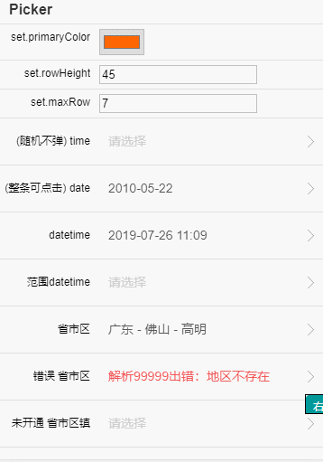
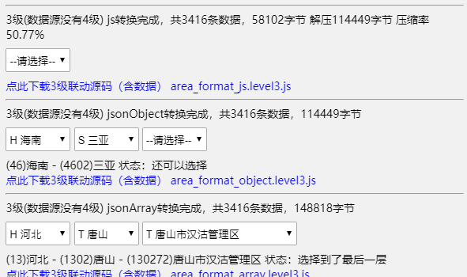

# :open_book:省市区数据采集并标注拼音、坐标和边界范围

[在线测试和预览（转换成JSON）](https://xiangyuecn.github.io/AreaCity-JsSpider-StatsGov/)；当前最新版为 **2019文件夹** 内的`2018.190827版数据`，此数据发布于`统计局2019-01-31`、`民政部2019-08-27`。

可直接打开[2019/采集到的数据](https://github.com/xiangyuecn/AreaCity-JsSpider-StatsGov/tree/master/2019/%E9%87%87%E9%9B%86%E5%88%B0%E7%9A%84%E6%95%B0%E6%8D%AE)文件夹内的文件来使用：
- [ok_data_level3.csv](https://github.com/xiangyuecn/AreaCity-JsSpider-StatsGov/blob/master/2019/%E9%87%87%E9%9B%86%E5%88%B0%E7%9A%84%E6%95%B0%E6%8D%AE/ok_data_level3.csv): 省市区3级数据。
- `ok_data_level4.csv`: 省市区镇4级数据。
- `ok_geo.csv.7z`: 为省市区3级的坐标和行政区域边界范围数据，csv格式，解压后130M+。

> csv格式非常方便解析成其他格式，算是比较通用；如果在使用csv文件过程中出现乱码、错乱等情况，需自行调对utf-8（带BOM）编码（或者使用文本编辑器 `如 notepad++` 把文件转成需要的编码），文本限定符为`"`。
> 
> csv文件导入数据库如果接触的比较多应该能很快能完成导入，坐标和边界可参考[2019/map_geo_格式化.js](https://github.com/xiangyuecn/AreaCity-JsSpider-StatsGov/blob/master/2019/%E5%9D%90%E6%A0%87%E5%92%8C%E8%BE%B9%E7%95%8C/map_geo_%E6%A0%BC%E5%BC%8F%E5%8C%96.js) 中SQL Server的导入流程。

**温馨建议：不要在没有动态更新机制的情况下把数据嵌入到Android、IOS、等安装包内；缓存数据应定期从服务器拉取更新**

## 数据源

- 国家统计局 > 统计数据 > 统计标准 > [统计用区划和城乡划分代码](http://www.stats.gov.cn/tjsj/tjbz/tjyqhdmhcxhfdm/)，此为主要数据源

- 民政部 > 民政数据 > [行政区划代码](http://www.mca.gov.cn/article/sj/xzqh/)，此数据源用来补全统计局的滞后不足

- 高德地图坐标和行政区域边界范围

## 采集环境

chrome 控制台，`Chrome 41`这版本蛮好，win7能用，`Chrome 46`这版本win10能用；新版本`Chrome 72+`乱码（统计局内页编码为`gb2312`，新版本`xhr`对编码反而支持的超级不友好，估计是印度阿三干的）、SwitchyOmega代理没有效果、各种问题（[简单制作chrome便携版实现多版本共存](https://github.com/xiangyuecn/Docs/blob/master/Other/%E8%87%AA%E5%B7%B1%E5%88%B6%E4%BD%9Cchrome%E4%BE%BF%E6%90%BA%E7%89%88%E5%AE%9E%E7%8E%B0%E5%A4%9A%E7%89%88%E6%9C%AC%E5%85%B1%E5%AD%98.md)）

## 采集深度

- 2019文件夹采集了4层，省、市、区、镇，[2018.190827版数据](http://www.stats.gov.cn/tjsj/tjbz/tjyqhdmhcxhfdm/2018/index.html)；省市区3级额外合并了[民政部2019-08-27数据](http://www.mca.gov.cn/article/sj/xzqh/2019/201908/201908271607.html)。采集高德省市区三级坐标和行政区域边界范围。
- 2018文件夹采集了3层，省、市、区，[2017版数据](http://www.stats.gov.cn/tjsj/tjbz/tjyqhdmhcxhfdm/2017/index.html)。
- 2017文件夹采集了3层，省、市、区，[2016版数据](http://www.stats.gov.cn/tjsj/tjbz/tjyqhdmhcxhfdm/2016/index.html)。
- 2013文件夹采集了4层，省、市、区、镇，[2013版数据](http://www.stats.gov.cn/tjsj/tjbz/tjyqhdmhcxhfdm/2013/index.html)。

## 【字段】ok_data表
省市区镇数据表。

字段|描述
:--:|--
id|统计局的编号经过去除后缀的`0{3,6,8}`得到的短编号；如果是添加的港澳台等数据，此编号为自定义编号
pid|上级ID
deep|层级深度，0：省，1：市，2：区，3：镇
name|城市名称，为统计局的名称精简过后的
pinyin_prefix|`name`的拼音前缀，取的是`pinyin`第一个字母；用来排序时应当先根据拼音前缀排序，相同的再根据名称排序
pinyin|`name`的完整拼音
ext_id|统计局原始的编号；如果是添加的港澳台等数据，此编号为0
ext_name|原始名称，为未精简的名称

## 【字段】ok_geo表
此表为坐标和行政区域边界范围数据表，因为数据文件过大（130M+），所以分开存储。由于边界数据的解析比较复杂，请参考[2019/map_geo_格式化.js](https://github.com/xiangyuecn/AreaCity-JsSpider-StatsGov/blob/master/2019/%E5%9D%90%E6%A0%87%E5%92%8C%E8%BE%B9%E7%95%8C/map_geo_%E6%A0%BC%E5%BC%8F%E5%8C%96.js)内的SQL Server的解析语句。

字段|描述
:--:|--
id|和`ok_data`表中的`ID`相同，通过这个`ID`关联到省市区具体数据，`map_geo_格式化.js`中有数据合并SQL语句
geo|城市中心坐标，高德地图`GCJ-02`火星坐标系。格式："lng lat" or "EMPTY"，少量的EMPTY代表此城市没有抓取到坐标信息
polygon|行政区域边界，高德地图`GCJ-02`火星坐标系。格式："lng lat,...;lng lat,..." or "EMPTY"，少量的EMPTY代表此城市没有抓取到边界信息；存在多个地块时用`;`分隔，每个地块的坐标点用`,`分隔，特别要注意：多个地块组合在一起可能是`MULTIPOLYGON`或者`POLYGON`，需用工具进行计算和对数据进行验证

## 【QQ群】交流与支持

欢迎加QQ群：484560085，纯小写口令：`areacity`

## 案例效果
 

# :open_book:测试和WEB数据格式转换工具

在线测试工具地址：[https://xiangyuecn.github.io/AreaCity-JsSpider-StatsGov/](https://xiangyuecn.github.io/AreaCity-JsSpider-StatsGov/)

或者直接使用`测试和WEB数据格式转换工具.js`，在任意网页控制台中使用。

此工具主要用于把csv数据转换成别的格式，另外提供省市区多级联动测试，并且可生成js源码（含数据）下载，3级联动生成的文件紧凑版68kb，4级联动紧凑版1mb大小。

## 工具支持：
1. 数据预览和测试。
2. 将csv数据导出成压缩后的紧凑版js格式纯数据文件，省市区3级数据65kb大小。
3. 将csv数据导出成JSON对象、JSON数组纯数据文件，省市区3级数据120kb+。
4. 网页版省市区镇多级联动测试。
5. 网页版省市区多级联动js代码生成（含数据）。

## 效果图

# :open_book:拼音标注

## 拼音源
省市区这三级采用在线拼音工具转换，据说依据《新华字典》、《现代汉语词典》等规范性辞书校对，多音字地名大部分能正确拼音，`重庆:chong qing`，`朝阳:chao yang`，`郫都:pi du`，`闵行:min hang`，`康巴什:kang ba shi`。

镇级以下地名采用本地拼音库（`assets/pinyin-python-server`）转换，准确度没有省市区的高。

## 拼音前缀
目前采用的是截取第一个字拼音的首字母。

### 排序方案：

方案一(2016版废弃)：取每个字的拼音首字母排序，比如：`河北:hb` `湖北:hb` `黑龙江:hlj` `河南:hn` `湖南:hn`

方案二(2018版废弃)：取的是第一个字前两个字母和后两个字首字母排序：`河北:heb` `黑龙江:helj` `河南:hen` `湖北:hub` `湖南:hun`

方案三(返璞归真)：取第一个字首字母进行排序，如果两个字母相同，再使用名称文本进行排序：`河北:h.河北` `河南:h.河南` `黑龙江:h.黑龙江` `湖北:h.湖北` `湖南:h.湖南`

排序方案三看起来好些；为什么不直接用名称文本进行排序，我怕不同环境下对多音字不友好，最差情况下也不会比方案一差。

# :open_book:坐标和行政区域边界范围

## 数据源
使用高德接口采集的，本来想采百度地图的，但经过使用发现百度地图数据~~有严重问题(百度已更新，不能复现了)~~：

参考 `肃宁县（右下方向那块飞地）`、`路南区（唐山科技职业技术学院那里一段诡异的边界）` 边界，~~百度数据大量线段交叉的无效`polygon`(百度已更新，不能复现了)~~（[百度地图测试](http://lbsyun.baidu.com/jsdemo.htm#c1_10)），没有人工无法修正，高德没有这个问题（[高德地图测试](https://lbs.amap.com/api/javascript-api/example/district-search/draw-district-boundaries)）；

并且高德对镂空性质的地块处理比百度强，参考`天津市`对`唐山`大块飞地的处理，高德数据只需要`Union`操作就能生成`polygon`，百度既有`Union`操作又有`Difference`操作，极其复杂数据还无效。

所以放弃使用百度地图数据。

## 如何使用坐标和边界数据

`坐标和边界数据` 和 `省市区` 数据是分开存储的，通过`ID`来进行关联。

可以把`ok_geo.csv`导入到数据库内使用，由于`POLYGON`需要解析，蛮复杂的，可以参考[2019/map_geo_格式化.js](https://github.com/xiangyuecn/AreaCity-JsSpider-StatsGov/blob/master/2019/%E5%9D%90%E6%A0%87%E5%92%8C%E8%BE%B9%E7%95%8C/map_geo_%E6%A0%BC%E5%BC%8F%E5%8C%96.js)内的SQL Server导入用的SQL语句的例子。

如果需要特定的`POLYGON`格式，可以根据上面介绍的字段格式，自行进行解析和验证。

使用过程中如果遇到多种不同坐标系的问题，比如请求的参数是`WGS-84坐标(GPS)`，我们后端存储的是高德的坐标，可以通过将`WGS-84坐标`转成`高德坐标`后进行处理，百度的坐标一样。转换有相应方法，转换精度一般可以达到预期范围，可自行查找。或者直接把高德的原始坐标数据转换成目标坐标系后再存储（精度？）。

## 边界效果预览

 

# :open_book:数据问题

1. id编号和国家统计局的编号基本一致，方便以后更新，有很多网站接口数据中城市编号是和这个基本是一致的。

2. `东莞`、`中山`、`儋州`等没有第三级区级，自动添加同名的一级作为区级，以保证整个数据结构的一致性，添加的区以上级的ID结尾加两个0作为新ID，此结构ID兼容性还不错，比如：东莞（4419）下级只有一个区 东莞（441900）。

3. 如果市、区没有下级，自动添加同名的一个城镇作为下级，以保证数据层次的一致性（任何一个数据都能满足省市区镇4级结构，没有孤立的）；比如：`福建-泉州-金门`没有镇，调整后为`福建-泉州-金门-金门`；另外从民政部中补全的城市也会缺失下级，照此规则自动补齐。

4. 直辖市（河南、湖北、海南、新疆 的县级行政区划）根据编号规则本来只能作为区级，但为了便于用户选择，所有直辖市自动添加一个同名的市级，比如：`湖北-直辖市-仙桃-*镇` 调整后为 `湖北-仙桃-仙桃-*镇`

5. 地区名字是直接去掉常见的后缀进行精简的，如直接清除结尾的`市|区|县|街道办事处|XX族自治X`，数量较少并且移除会导致部分名字产生歧义的后缀并未精简。

6. 2017版开始数据结尾添加了自定义编号的`港澳台` `90`、`海外` `91`数据，此编号并非标准编码，而是整理和参考标准编码规则自定义的，方便用户统一使用（注：民政部的台港澳编码为71、81、82）。

7. 2018.190621版开始统计局采集过来的数据会和民政部的数据交叉对比后进行合并；由于统计局的数据明显的滞后，民政部内新添加的市、区将不会有镇级（自动补齐同名镇级）；如果民政部数据存在明文撤销的市、区，那么合并的时候会删除统计局对应的数据，如：`山东-莱芜市`于2019-01撤销，并在`济南市`新加`莱芜区`、`钢城区`；如果统计局中的数据在民政部数据内不存在，将原样保留，如：西沙群岛、100多个高新区、经济开发区。实际对比发现：统计局多出约150条数据；相对民政部缺失的数据很少（估计统计局下次发布就能抹平）；统计局和民政部的编号完全一致。

8. 参考链接：[统计用区划代码和城乡划分代码编制规则](http://www.stats.gov.cn/tjsj/tjbz/200911/t20091125_8667.html)，[民政部发布的行政区划代码](http://www.mca.gov.cn/article/sj/xzqh/)。

9. 2018版开始从高德采集了省市区三级坐标和行政区域边界范围数据，省市区总计3300+条数据，未采集到边界的有160条以内。关于未获取到坐标或边界的城市，本采集方案采取不处理策略，空着就空着，覆盖主要城市和主要人群，未覆盖区域实际使用过程中应该进行降级等处理。比如：尽最大可能的根据用户坐标来确定用户所在城市，因为存在没有边界信息的区域，未匹配到的应使用ip等城市识别方法。

## 2019修正数据

- [issues/2](https://github.com/xiangyuecn/AreaCity-JsSpider-StatsGov/issues/2) `乐亭县` 的 `乐`读`lào` ，此县下面的`乐亭`读音均已修正。

# :open_book:使用js自行采集

在低版本chrome控制台内运行1、2、3打头的文件即可完成采集，前提是指定网页打开的控制台。这三个文件按顺序执行。

最新采集代码内对拼音转换的接口变化蛮大，由于优秀的那个公网接口采取了IP限制措施，就算使用了全自动的切换代理，全量转换还是极为缓慢，因此采用了本地转换接口和公网转换接口结合的办法，省市区三级采用公网接口，其他的采用本地接口。公网接口转换的正确度极高，本地的略差那么一点。

## 步骤1

1. 打开国家统计局任页面 http://www.stats.gov.cn/tjsj/tjbz/tjyqhdmhcxhfdm/。
2. 控制台内粘贴`1_1_抓取国家统计局城市信息.js`代码执行。
3. 采集完成自动弹出下载，保存得到文件`data1_1.txt`。
4. 同样类似操作，在民政部网址把`1_2_抓取民政部城市信息.js`执行，就能得到统计局和民政部合并的数据`data1_2.txt`。

## 步骤2

1. 启动`assets/pinyin-python-server`中的本地拼音服务，根据`2_1_抓取拼音.js`中的提示对4级进行本地拼音转换，得到`data-pinyin-local.txt`。
2. 根据`2_2_抓取拼音.js`开头注释打开拼音接口页面，然后导入数据，进行省市区3级进行高准确度拼音转换。
3. 拼音采集完成自动弹出下载，保存得到文件`data-pinyin.txt`。

## 步骤3

1. 任意页面，最好是第二步这个页面，根据`3_格式化.js`中的提示导入`data-pinyin.txt`，并执行代码。
2. 格式化完成自动弹出下载，保存得到最终文件`ok_data_1234.csv`。

## 坐标和行政区域边界采集

使用`坐标和边界`目录内的`map_geo.js`、`map_geo_格式化.js`在[高德地图测试页面](https://lbs.amap.com/api/javascript-api/example/district-search/draw-district-boundaries)，根据文件内的说明即可完成采集。

# :open_book:其他资源
- 全国基础地理数据库：[http://www.webmap.cn](http://www.webmap.cn)
- OpenStreetMap：[https://www.openstreetmap.org](https://www.openstreetmap.org)

# :star:捐赠
如果这个库有帮助到您，请 Star 一下。

你也可以选择使用支付宝给我捐赠：

  
